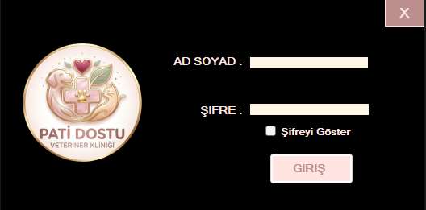
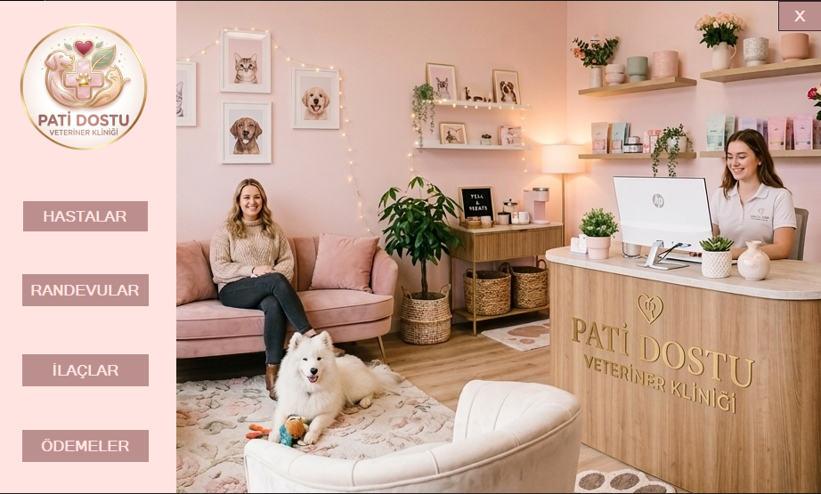
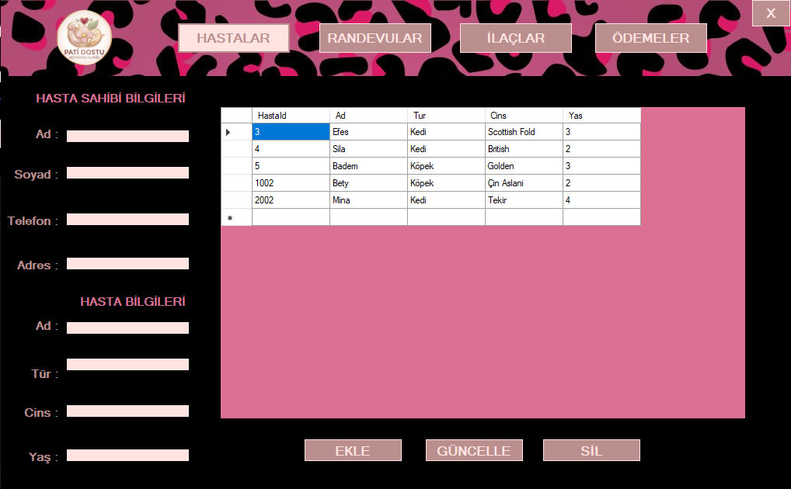
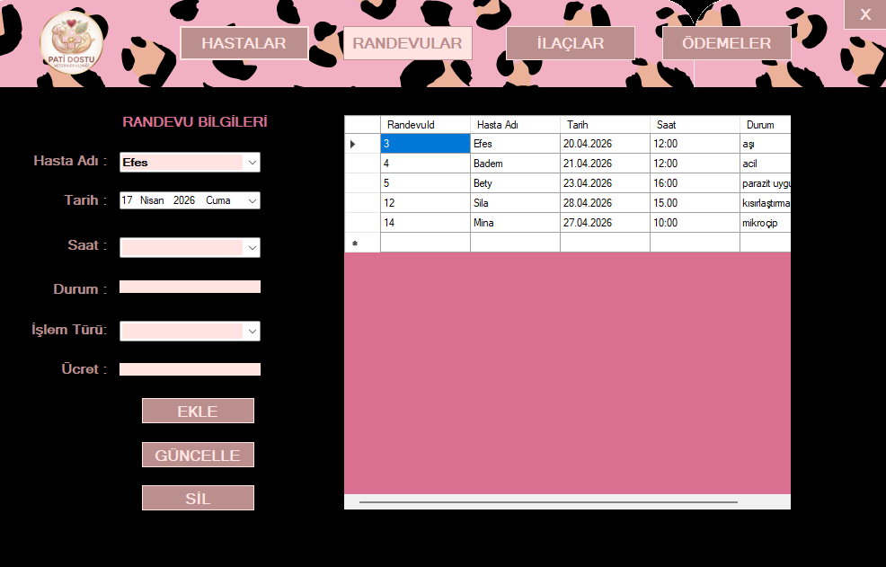
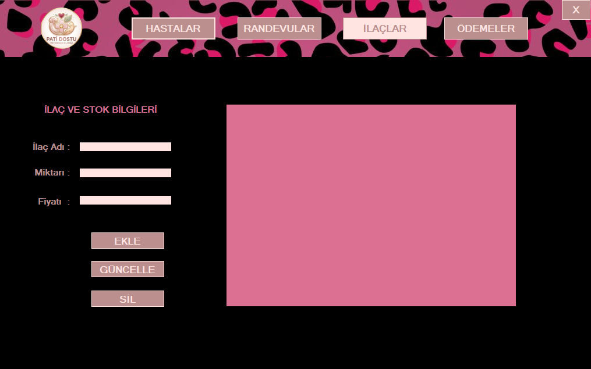

# 🐾 Pati Dostu Veteriner Klinik Otomasyonu

Bu proje, günümüzde hızla artan evcil hayvan sahipliği oranına bağlı olarak veteriner kliniklerinde oluşan karmaşık iş yükünü yönetmek amacıyla geliştirilmiştir. 
 Manuel kayıt tutma süreçlerini dijitalleştirerek, hata payını minimize etmeyi ve klinik verimliliğini artırmayı hedefler.

## 🎯 Projenin Amacı
* Kliniklerdeki karmaşık veri trafiğini tek bir merkezden yönetilebilir hale getirmek.
* Hastaların tüm medikal geçmişine saniyeler içinde ulaşılmasını sağlamak.
* Randevu çakışmalarını ortadan kaldırmak ve kliniğin finansal/stok durumunu şeffaf bir şekilde izlemek.
* Veteriner hekimlerin idari işlerle vakit kaybetmesini önleyerek asıl odak noktaları olan hayvan sağlığına vakit ayırmalarına destek olmak.

## 🛠️ Kullanılan Teknolojiler
* **Yazılım Dili:** C# (Form Apps)
* **Veritabanı:** Microsoft SQL Server (MS SSMS)
* **Geliştirme Ortamı:** Visual Studio 2022

## 📋 Temel Modüller
* **Hasta ve Sahibi İşlemleri:** Evcil hayvan (tür, cins, yaş) ve sahibi bilgilerini ekleme, silme, güncelleme ve arama.
* **Randevu Yönetimi:** Klinik takvimi üzerinden randevu oluşturma ve geçmiş randevuların listelenmesi.
* **Tıbbi Geçmiş ve Aşı Takibi:** Hayvanlara yapılan aşıların, operasyonların ve kullanılan ilaçların tarihsel takibi.
* **Stok ve Ödeme İşlemleri:** İlaç/mama stok takibi ve yapılan işlemlerin faturalandırılması.

## ⚙️ Algoritma Akışı
1. **Giriş:** Kullanıcı adı ve şifre doğrulaması yapılır.
2. **Seçim:** Ana menüden ilgili işlem modülü (Hasta Kayıt, Randevu, Stok vb.) seçilir.
3. **Veri Girişi:** Seçilen modülde işlemler gerçekleştirilir ve veriler SQL veritabanına kaydedilir.
4. **Onay:** İşlem başarılı mesajı gösterilir ve ana menüye dönülür.

## 👥 Hedef Kullanıcılar
* Veteriner Hekimler 
* Klinik Asistanları 
* Klinik Yöneticileri

## 📸 Ekran Görüntüleri

Projenin temel arayüz tasarımları ve kullanım akışı aşağıda sunulmuştur:

### 🔐 Giriş Paneli
Veteriner ve yöneticilerin sisteme güvenli erişim sağladığı modül.

### 🏠 Ana Menü (Dashboard)
Tüm klinik işlemlerinin merkez üssü.

### 🐾 Hasta Kayıt ve Sorgulama
Evcil hayvanların ve sahiplerinin detaylı bilgilerinin yönetildiği alan.

### 📅 Randevu Yönetimi
Klinik takviminin ve randevu çakışmalarının kontrol edildiği modül.

### 💊 Stok ve İlaç Takibi
İlaç envanterinin ve kritik stok seviyelerinin izlendiği ekran.

### Ödeme Takibi
Ödeme ekranı.

